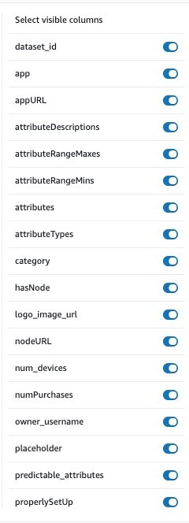

# Artificien: Infrastructure
This repo stores infrastructure and deployment code for the Artificien platform as a single source for deployment. Infrastructure includes a DynamoDB (NoSQL database) utilized by the Marketplace, the severless backend, mechanisms to distribute and train models remotely, and any other cloud resources which may be relevant to the product.

## Database Structure

## Architecture
- `Amplify`: Handles the deployment of the front end of the Artificien Website. Deploys a new copy every time a new commit is pushed to the master branch of our artificien_marketplace repostiory (continuous deploys). Amplify automatically integrates the frontend with its associated backed resources, such as our authentication mechanism, `Cognito`. View the code for our amplify resources [here](./cdk_stacks/amplify_stack.py).
- `Cognito`: Handles authentication to the Artificien website and to our JupyterHub development environment. Provides an email-based confirmation service for new signups, and other authentication features. View the code for our cognito resources [here](./cdk_stacks/cognito_stack.py).
- `Dynamo DB`: Stores data for the website and user data generated by Cognito. Note that our DynamoDB resources were originally deployed via [this code](./cdk_stacks/dynamo_db_stack.py). Over time, however, we have come to rely more on the console in order to make agile changes to the Dynamo, and that code is now deprecated. Below, we provide screenshots of all of our up-to-date Dynamo schemas.
- `Data Upload Lambda`: This is a serverless backend service which responds to requests to register a new app/datset via https://artificien.com/register_app. Once a user puts in the user data attribute types and data ranges that their iOS app collects (example attribute might be: `BMI`, type: `int`, range: `10-40`), this lambda auto-generates a "sample dataset" so that users can test whether or not their models work on sample data before formally deploying their models to be trained by client devices. This lambda then automatically places new auto-generated sample dataset CSV files to an Amazon S3 bucket, at which point our JupyterHub server automatically pulls updates to that S3 bucket. In this way, new sample datasets are made available to users via JupyterHub less than 30 minutes after the dataset is onboarded.
- `Model Retrieval Lambda`: this [module](./cdk_stacks/model_retrieval_lambda_stack.py) formerly conducted model retrieval - that, is, it allowed users to download their machine learning models once they had finished training on client devices. This function is now performed by our Master Node (or Orchestration Node) service, which is described in greater detail below. 
- `Post Confirmation Lambda`: This simple lambda onboards a user to our dynamo database immediately after a user has signed up and confirmed their Artificien account via email. It also auto-generates an API key for our app developer users to use to onboard their iOS applications. View the code [here](./lambdas/post_confirmation_lambda/lambda_function.py).
- `Jupyter`: Deploys a multi-user JupyterHub server, gated by Cognito, which can be used by Artificien customers to train and deploy models. Artificien customers will head to JupyterHub for all their model-engineering and model-uploading needs. This is where they first deploy their models for federated learning. JupyterHub can be reached at [this url](https://jupyter.artificien.com). Jupyter is configered to automatically pull all new sample datasets and tutorials that artificien provides and makes them immediately available to all users. View the coder [here](./cdk_stacks/jupyter_service_stack.py).
- `ECS Cluster`: This [cloud resource](./cdk_stacks/ecs_cluster_stack.py) allows us to run docker containers as services in the cloud, via AWS's "Elastic Container Service". We run docker-based backend services for both our "Master/Orchestration Node", and for our "Pygrid" nodes, the backend services which host client's machine learning models and facilitate the federated learning process.
- `Orchestration Node`: The [orchestration node](./cdk_stacks/orchestration_stack.py) has a wide array of responsibilties, including spinning up and down Pygrid nodes , handling model upload, handling model retrieval, and more. You can read (much) more [here](https://github.com/dartmouth-cs98/artificien_orchestration_node/).

#### DynamoDB schemas:
Since we haven't gotten the chance to update our Dynamo Schema's in this code base, we've provided the screenshots below to showcase which attributes we track in our NoSQL database.

Model - represents a machine learning model:

Dataset - represents an application that has onboarded with Artificien:

User - represents an Artificien user account:

## Setup
- Install aws cli: ` python -m pip install awscli`
- Configure aws credentials for your terminal: `aws configure`, and paste in the access Access Key ID and Secret Access Key for our AWS account.
- Install aws cdk: `npm i -g aws-cdk`

## Deployment

- Enter top-level directory
- Install python libraries: `pip install -r requirements.txt`
- If you want to deploy all resources, or need to deploy one of the lambda functions, you may need to run `cdk bootstrap` first. Uploading code artifacts to AWS, a key step in deploying any lambda function, requires this command to have been run recently before a deployment.
- To deploy all resources
  - `cdk synth` - to create cloudformation templates
  - `cdk diff` - to see what changes will be made to our deployments
  - `cdk deploy` - to deploy new changes to **all** resources
- To deploy just one resource:
  - `cdk deploy dynamo-db` or `cdk deploy amplify` or `cdk deploy jupyter` or `cdk deploy cognito` or `cdk deploy pygrid` or `cdk deploy dataUploadLambda`, etc.. Check the `app.py` file to find names of other stacks that we may add as we develop.
 
- Additional information on the cdk can be found in the basic CDK [instructions manual](./CDK_INSTRUCTIONS.md) located in this repo, or on the CDK [API reference docs](https://docs.aws.amazon.com/cdk/api/latest/docs/aws-construct-library.html)

## Usage
- See all aws resources that have been created by viewing the `app.py` file.
- Add new python package requirements by adding them to the `requirements.txt`
- Tests. Our `tests` directory is out of date, but is left as a demonstration of the general means by which one should create unit and integreation tests for AWS CDK codebases. can be understood by

## Authors
* Matt Kenney
* Alex Quill
* Jake Epstein

## Acknowledgments
Special thanks to Professor Tim Tregubov for his guidance during our two-term COSC 098 course.
